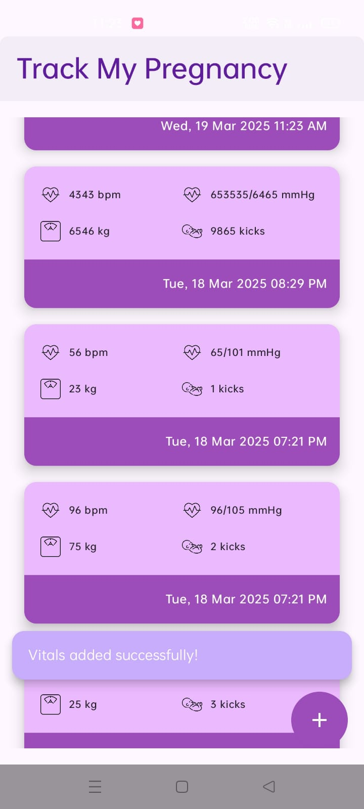
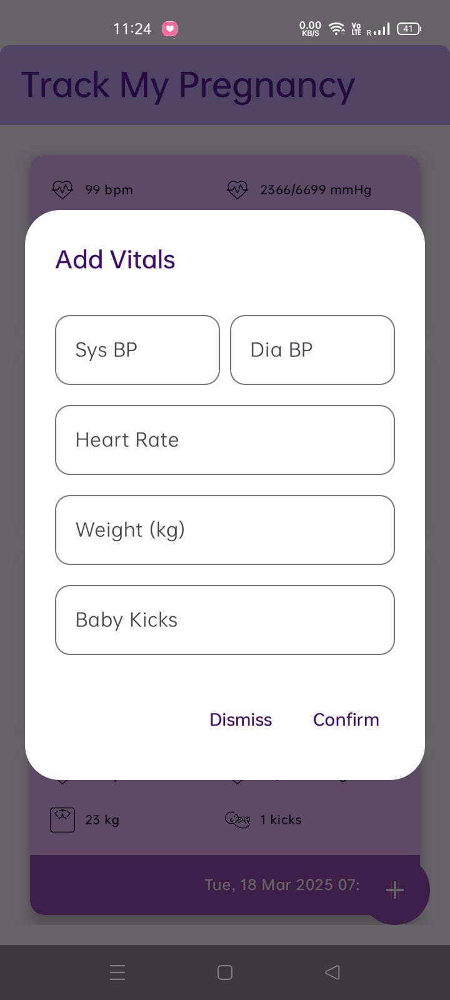
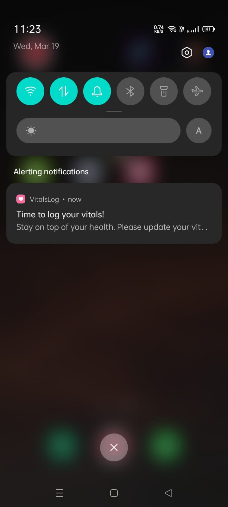

# 🩺 Vitals Tracker  

Vitals Tracker is an Android app designed to help users log and track their vital health statistics efficiently. The app includes an automated reminder system that notifies users every 5 hours to update their vitals, ensuring they stay on top of their health.  

##  Features  

 **Vitals Logging** – Users can log their vital signs such as blood pressure, heart rate, and more.  
 **Automated Reminders** – A notification is sent every 5 hours using WorkManager.  
 **Direct Navigation** – Clicking the notification opens the logging screen directly.  
 **Jetpack Compose UI** – Modern, declarative UI for a seamless experience.  
 **Local Data Storage** – All vitals are saved using Room Database for offline access.  
 **Background Task Execution** – WorkManager ensures notifications run even if the app is closed.  
 **Dependency Injection** – Hilt is used to manage dependencies efficiently.  
 **Coroutines & Flow** – Ensures smooth, asynchronous operations.  

---

##  How It Works  

1. **Vitals Logging:** Users can enter their vital statistics in a structured format.  
2. **Background Reminders:** The app uses WorkManager to schedule periodic reminders every 5 hours.  
3. **Notification Handling:** When the user taps the notification, the app opens directly to the logging screen.  
4. **Data Storage:** Vitals are stored locally using Room Database for easy retrieval and offline access.  
5. **App Lifecycle Resilience:** WorkManager ensures reminders persist even after the app is closed or the device is restarted.  

---
##  Screenshots

### Home Screen

### Log Screen

### Notification

##  Tech Stack  

*Kotlin*   
*Jetpack Compose*   
*Room Database*   
*WorkManager*   
*Hilt (Dagger)*   
*Coroutines & Flow*  
*LiveData & ViewModel*  

---

